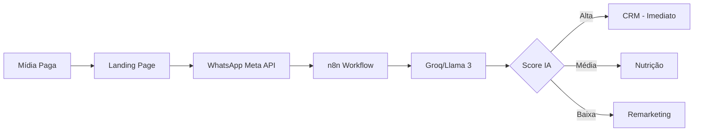

## 👋 Sobre Mim

Sou uma **AI/ML Engineer** em transição estruturada de **Marketing Digital → Engenharia de IA**, com **2 anos entregando soluções de IA Generativa em produção** que geram impacto mensurável de negócio.

<div align="center">
  
  
  
</div>

### 🔧 Minhas Competências Técnicas

| Área | Tecnologias |
|------|-------------|
| **IA & LLMs** | Groq (Llama 3), Gemini, Snowflake Cortex, RAG, Prompt Engineering |
| **Engenharia de Dados** | BigQuery, Snowflake, Databricks, SQL avançado, ETL/ELT pipelines |
| **Cloud** | Google Cloud Platform (2+ anos), AWS (1+ ano), Azure Databricks |
| **Desenvolvimento** | Python, TypeScript, React, n8n, Git/GitHub, Serverless |
| **Foco Estratégico** | MLOps, Orquestração de Agentes, Data Apps, Conformidade LGPD |

### 🚀 Projetos em Produção
- **🤖 Lead Qualification AI**: 48% de conversão, 50k+ interações/mês  
- **📊 BudgetMind SaaS**: R$500k+/mês gerenciado, ROAS médio de 3.2x  
- **💬 Snowflake Cortex Chatbot**: Acesso a dados sem SQL para times não técnicos

---

## 🚀 Projetos em Produção

### 🤖 Sistema de Qualificação de Leads com IA
**Chatbot inteligente via WhatsApp que qualifica leads em tempo real com conformidade LGPD**

<div align="center">

| Stack | Resultados |
|:-----:|:----------:|
|     | **48%** taxa de conversão<br/>**94%** opt-in LGPD<br/>**5 min** tempo de resposta<br/>**50k+** interações/mês |

</div>

**Destaques Técnicos:**
- ✅ Orquestração n8n (Render.com serverless)
- ✅ Groq/Llama 3 para classificação em tempo real
- ✅ Retry logic com exponential backoff
- ✅ Conformidade total LGPD (consentimento explícito)

<details>
<summary>📐 Ver Arquitetura</summary>


</details>

[📂 Ver Documentação](./projects/lead-qualification-ai/)

---

### 📊 BudgetMind - Plataforma SaaS de Otimização de Budget
**Sistema que usa Gemini AI para sugerir redistribuição de investimento em mídia paga**

<div align="center">

| Stack | Resultados |
|:-----:|:----------:|
|     | **R$500k+**/mês gerenciado<br/>**3.2x** ROAS médio<br/>**2h → 10min** análise<br/>**+15-30%** ROAS com IA |

</div>

**Destaques Técnicos:**
- ✅ React + TypeScript (type-safe, componentizado)
- ✅ Google Cloud Functions (serverless, auto-scaling)
- ✅ BigQuery para consolidação multicanal (Google, Meta, TikTok, Shopee)
- ✅ Gemini AI para recomendações preditivas
- ✅ Análise geográfica granular (País → Estado → Cidade)

[📂 Ver Documentação](./projects/budgetmind/)

---

### 💬 Chatbot de Dados com Snowflake Cortex
**Agente conversacional que responde perguntas sobre dados em linguagem natural**

<div align="center">

| Stack | Resultados |
|:-----:|:----------:|
|   | **POC em minutos**<br/>**Zero SQL** necessário<br/>Democratiza dados |

</div>

**Caso de Uso:** Executivos fazem perguntas como *"Qual o ROAS do Google Ads em SP no último trimestre?"* e recebem respostas instantâneas sem conhecer SQL.

[📂 Ver Documentação](./projects/snowflake-cortex-chatbot/)

---

## 🏆 Certificações

### 🤖 IA & Machine Learning


### 📊 Data Engineering


### ☁️ Cloud & Analytics


**→ [Ver todas as certificações](./certifications/)**

---

## 💻 Stack Técnico

### **Linguagens & Frameworks**


### **IA & LLMs**


### **Data & Analytics**


### **Cloud & DevOps**


### **Orquestração & Automação**


---

## 📊 GitHub Stats

<div align="center">
  
  
</div>

<div align="center">
  
</div>

---

## 📚 Formação Acadêmica

| 🎓 Instituição | 📖 Curso | 📅 Período |
|:--------------|:---------|:-----------|
| **Faculdade UniBF** | MBA em Data Warehouse e Business Intelligence | Jan/2025 – Ago/2026 |
| **DataCamp** | Postgraduate: Data Engineer de IA (Python) | Ago/2025 – Dez/2026 |
| **Universidade Paulista** | Análise e Desenvolvimento de Sistemas | 2013 – 2015 |

---

## 🎯 O Que Me Diferencia

```diff
+ 2 anos entregando IA em PRODUÇÃO (não só POCs)
+ Visão de negócio (10+ anos): traduzo requisitos em soluções técnicas viáveis
+ Projetos com métricas reais: 48% conversão, R$500k gerenciado, 50k+ interações/mês
+ Conformidade LGPD desde o design (não afterthought)
+ Stack moderno: LLMs, Cloud, MLOps, Data Engineering
```

---

## 📬 Vamos Conversar?

<div align="center">
  
  **Interessado em:**
  - 🤝 Consultorias em IA Generativa & Automação
  - 💼 Oportunidades full-time em AI/ML Engineering
  - 🎓 Parcerias em projetos de dados & IA para marketing
  
  <br/>
  
  <a href="https://linkedin.com/in/marinanagashima">
    
  </a>
  <a href="mailto:marina_vborges@hotmail.com">
    
  </a>
  <a href="https://calendar.google.com/calendar/u/0/appointments/schedules/AcZssZ0VVe_zVPlqTkd9FqHPKjLr5YRqMhqH65JqTmMqOX4XkYj8Mf6uPjhJ9WjNQfnKHW0T9KY8kLxz">
    
  </a>
  
</div>

---

<div align="center">
  
  <br/><br/>
  <sub>💜 Feito com IA Generativa • Atualizado Janeiro 2026</sub>
</div>
```
